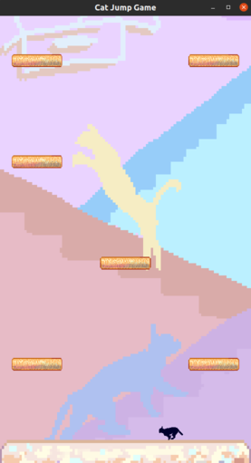

# Cat Jump #

Simple juego de plataformas 2D en Python usando OpenGL.




## Preámbulo ##

Un gatito observa en lo más alto de la torre de rascaderos una bola de lana con la cuál jugar,
pero mientras escala, la mascota del hogar (un travieso perro) se da cuenta y quiere meter sus
narices donde no debe.
Ayuda al gato a conseguir la bola de lana mientras evitas que caiga a la base. En altura estará
tranquilo fuera del alcance de ciertas patitas felpudas.

## Instrucciones de Ejecución ##

### Llamado en Consola ###

Abrir la carpeta ```codigo``` donde se encuentra el script. El comando para iniciar el juego es:

    python cat_jump.py [structure.csv]

Donde ```[structure.csv]``` es un parámetro opcional con la ruta de un archivo csv que personaliza
la estructura del nivel. El archivo debe consistir de tres columnas y un número arbitrario de filas
de ceros y uno, donde 1 indica la presencia de una plataforma y 0 que no. Evitar colocar una fila de
solo ceros pues esto impide el avance por el nivel.

Si no se especifica este parámetro, se usa el archivo en ```codigo/ex_structure.csv```.

### Controles ###

Para desplazarse a la izquierda se usa la tecla **A** y para moverse a la derecha se usa **B**, 
manteniéndolas presionadas para ganar velocidad y soltándolas para detenerse.

Los saltos se realizan presionando **W** una vez, no existen saltos múltiples en el aire.

### Requerimientos ###
Python 3 o superior.

Todas las librerías en ``codigo`` son requeridas. Adicionalmente el programa usa `numpy`, `glfw` y `pyopengl`.

## Créditos ##
Realizado como tarea para el curso Modelación y Computación Gráfica para Ingenieros (CC3501) de la Universidad de Chile,
del semestre de primavera 2020.

Muchas de las librerías de apoyo como ``easy_shaders.py`` o `basic_shapes.py` son de Daniel Calderón.

### Autor ###

Valentina Garrido, 2020.


